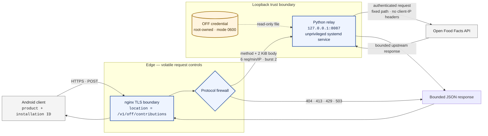

# Lethio relay infrastructure

The infrastructure boundary behind Macro Tracker's optional contributions to
[Open Food Facts](https://world.openfoodfacts.org/). It keeps the Open Food Facts credential out of
the Android application while deliberately retaining as little information as possible.

This repository contains the nginx and systemd configuration for that boundary, executable policy
tests, and the reasoning behind the design. It is a curated reference implementation, not a backup
of the server and not a one-command deployment.

## Request path



The IP address exists while TCP is carrying the request; no design can make that untrue. The
privacy claim is narrower and testable: this path does not write an access log, does not forward
client-address headers to the relay, and uses only a bounded in-memory address key for rate
limiting. The relay has no request database and no writable application-data directory.

## How the design got here

### 1. A secret in an APK is not a secret

The first implementation authenticated to Open Food Facts from the Android application. That made
the application pleasantly serverless, but it also required every installed copy to recover the
same credential. Encryption and obfuscation only move that recovery process around: the phone must
eventually possess both the secret and everything required to use it.

The credential therefore moved to a machine under Lethio's control. That solved the credential
problem and created a new privacy problem: the relay became able to observe incoming connections.

### 2. nginx became a protocol firewall

The public surface is one exact-match location. nginx rejects unsupported methods, oversized
bodies and excess request rates before Python sees them. It clears query arguments, fixes the
upstream path, strips client-address headers, disables caching, and bounds each stage with explicit
timeouts.

nginx can generate failures itself, so its error paths are part of the API. Named internal
locations normalize method, size, rate-limit and upstream failures into the same small JSON state
machine used by the application. They also prevent the machine endpoint from falling into the
website's human-facing 404 handler and ordinary access log.

### 3. The process lost privileges and places to write

The relay binds to loopback and runs as a dedicated user. systemd gives it a read-only filesystem,
private temporary storage, an empty capability set, no new privileges, no core dumps, restricted
address families and no routine stdout or stderr sink. The credential is a root-managed mode-0600
file referenced by path; it is never an environment value or command-line argument.

The service still needs outbound DNS and HTTPS, so this is confinement rather than a claim of
perfect isolation. The useful property is that a compromised relay process has very little local
authority and no writable application state to turn into a quiet database.

### 4. Abuse control stayed ephemeral

Per-address throttling happens in nginx's bounded shared-memory zone using
`$binary_remote_addr`. It is operational state, not an identity system: it expires from memory and
is not written to a rate-limit database. A separate application-wide concurrency cap protects the
upstream service without tracking individual installations.

### 5. Tests became part of the configuration

Several important properties are negative—no forwarded IP address, no access log, no credential
value, no writable service directory—and are easy to remove accidentally during an otherwise
reasonable edit. The tests encode those constraints and CI also asks nginx to parse the real
snippets. A green test is not deployment evidence, but it is a useful refusal to regress silently.

## Repository layout

```text
nginx/
  lethio-off-relay-location.conf     exact endpoint and normalized errors
  lethio-off-relay-rate-limit.conf   bounded in-memory per-address limiter
systemd/
  lethio-off-relay.service           process identity and confinement
tests/
  nginx.conf                         native nginx syntax harness
  test_configuration.py              security and privacy invariants
```

## Integration

The rate-limit declaration belongs in nginx's `http` context:

```nginx
include /etc/nginx/conf.d/lethio-off-relay-rate-limit.conf;
```

The endpoint snippet belongs inside exactly one TLS `server` block:

```nginx
server {
    listen 443 ssl;
    server_name example.com;

    include /etc/nginx/snippets/lethio-off-relay-location.conf;
}
```

The snippets assume a relay on `127.0.0.1:8087` implementing the fixed
`/v1/off/contributions` protocol. The unit assumes the application is installed at
`/opt/lethio-off-relay/current` and the credential file at
`/etc/lethio-off-relay/off-credentials.json`.

Before using any of this elsewhere, replace the service paths and capacity limits with values from
your own threat model, validate nginx with `nginx -t`, inspect the effective systemd sandbox with
`systemd-analyze security`, and test the complete request path on the target distribution.

## Verification

The policy tests use only Python's standard library:

```sh
python -m unittest discover -s tests -v
```

Native nginx syntax verification, also run by CI:

```sh
mkdir -p tests/runtime/{body,proxy,fastcgi,uwsgi,scgi}
nginx -t -p "$PWD/" -c tests/nginx.conf
```

## What is intentionally absent

This repository does not contain credentials, keys, public-key inventories, IP addresses, host
fingerprints, certificate serials, package inventories, live server facts, deployment evidence or
backup procedures. Those are operational records, not ingredients of the design.

It also does not deploy anything. Publishing a reference configuration and changing a production
server are separate acts with separate review and verification.

## License

[MIT](LICENSE) © 2026 Terje Rutgersen.
